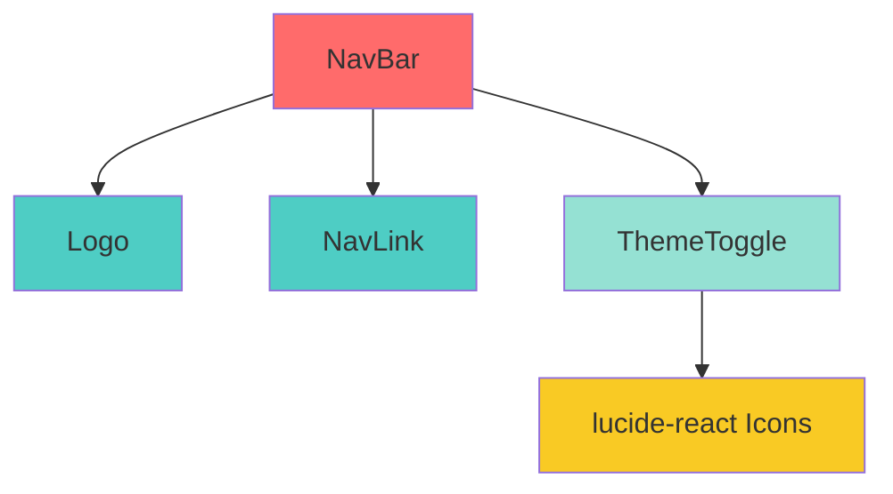

# Architecture Atomic Design - Vue d'ensemble

## Diagramme de la hiérarchie actuelle

```
┌─────────────────────────────────────────────────────┐
│                   🦠 ORGANISMS                       │
│                                                      │
│  ┌────────────────────────────────────────────┐    │
│  │              NavBar                        │    │
│  │  ┌──────────┬──────────────┬────────────┐ │    │
│  │  │   Logo   │  NavLink[]   │ThemeToggle │ │    │
│  │  └────┬─────┴───────┬──────┴─────┬──────┘ │    │
│  └───────┼─────────────┼────────────┼────────┘    │
└──────────┼─────────────┼────────────┼─────────────┘
           │             │            │
           │             │            │
┌──────────┼─────────────┼────────────┼─────────────┐
│          │             │            │             │
│      ⚛️ ATOMS      ⚛️ ATOMS    🧬 MOLECULES       │
│          │             │            │             │
│      ┌───┴───┐    ┌────┴────┐  ┌───┴──────┐      │
│      │ Logo  │    │ NavLink │  │ThemeToggle│      │
│      └───────┘    └─────────┘  └──────────┘      │
│                                     │             │
│                                ┌────┴─────┐       │
│                                │ Sun/Moon │       │
│                                │  Icons   │       │
│                                └──────────┘       │
│                                  (lucide-react)   │
└──────────────────────────────────────────────────┘
```

## Flux de composition

### NavBar (Organism)

```tsx
<NavBar>
  └─ <Logo />                    // Atom
  └─ <NavLink /> × N            // Atom (itéré)
  └─ <ThemeToggle />            // Molecule
      └─ <Sun /> / <Moon />     // Icons (externe)
```

## Responsabilités par niveau

### ⚛️ Atoms

| Composant | Responsabilité             | Props clés                   |
| --------- | -------------------------- | ---------------------------- |
| `Logo`    | Afficher le logo cliquable | `text`, `href`, `className`  |
| `NavLink` | Lien de navigation stylisé | `label`, `href`, `className` |

### 🧬 Molecules

| Composant     | Responsabilité                 | Atoms utilisés   | État                            |
| ------------- | ------------------------------ | ---------------- | ------------------------------- |
| `ThemeToggle` | Basculer le thème clair/sombre | Icons (Sun/Moon) | `useState` pour le thème actuel |

### 🦠 Organisms

| Composant | Responsabilité                | Composition                    | État                                   |
| --------- | ----------------------------- | ------------------------------ | -------------------------------------- |
| `NavBar`  | Navigation principale du site | Logo + NavLink[] + ThemeToggle | Aucun (stateless, délègue aux enfants) |

## Dépendances



## Règles de composition

### ✅ Autorisé

- Organisms → Molecules → Atoms
- Organisms → Atoms directement
- Molecules → Atoms
- Atoms → Aucune dépendance interne

### ❌ Interdit

- Atoms → Molecules ou Organisms
- Molecules → Organisms
- Dépendances circulaires

## Extension future

Pour ajouter un nouveau niveau (Templates / Pages), la structure serait :

```
src/components/
├── atoms/
├── molecules/
├── organisms/
├── templates/      # Layouts avec placeholders
│   └── MainLayout.tsx
└── pages/          # Pages complètes (optionnel si on utilise Next.js App Router)
```

**Note :** Avec Next.js App Router, le dossier `src/app/` remplace efficacement le niveau "Pages" d'Atomic Design.

## Avantages de cette architecture

1. **Réutilisabilité** : Les atoms sont utilisables partout
2. **Testabilité** : Chaque niveau peut être testé isolément
3. **Scalabilité** : Facile d'ajouter de nouveaux composants
4. **Maintenance** : Modifications localisées (changer `Logo` affecte uniquement `NavBar`)
5. **Documentation** : Structure autodocumentée par la hiérarchie
6. **Onboarding** : Nouveaux développeurs comprennent rapidement l'organisation

## Ressources

- [Atomic Design par Brad Frost](https://atomicdesign.bradfrost.com/)
- [Pattern Lab](https://patternlab.io/)
- [Storybook pour Atomic Design](https://storybook.js.org/docs/react/workflows/atomic-design)
